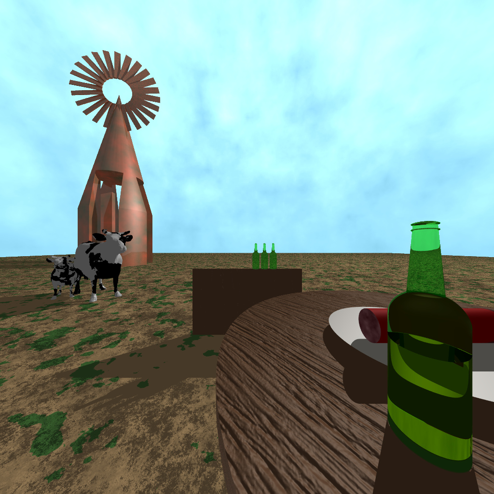
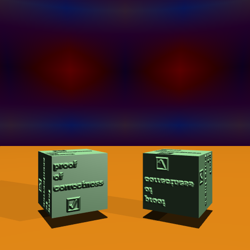
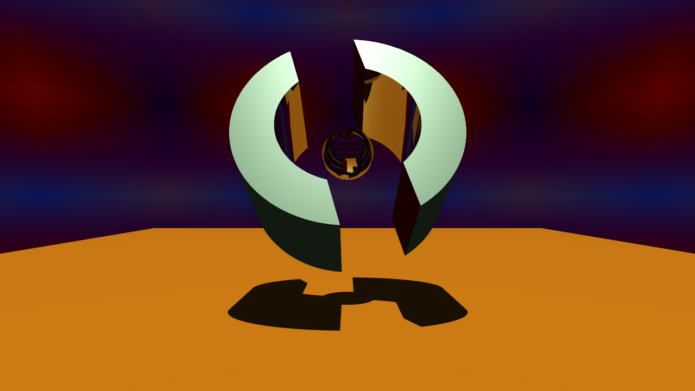
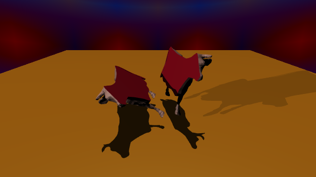
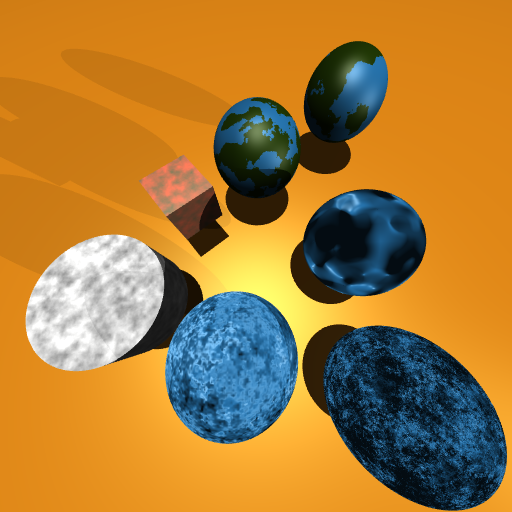
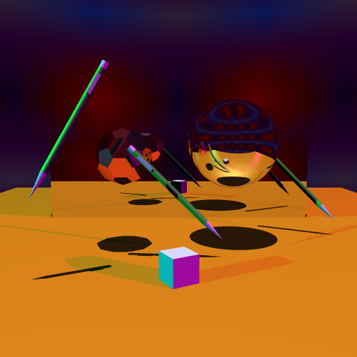
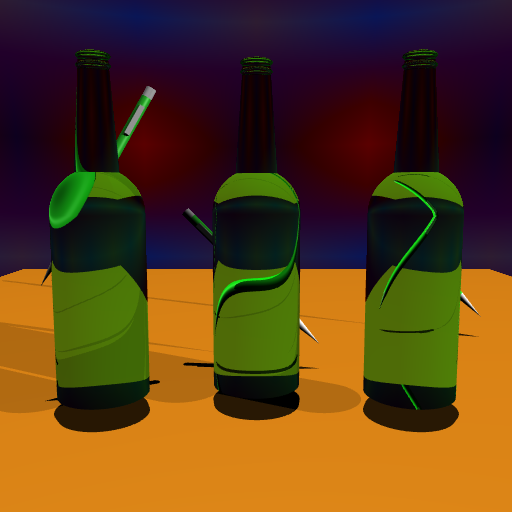

# RayTracer
This repository shows off a series of sample ray tracing images rendered by a ray tracer for the final project of CS488: Intro to Computer Graphics.

Final image, with many rendering techniques displayed.

Bump Mapping.

Constructive Solid Geometry with reflective surfaces and meshes.

Perlin Noise used to perturb colour and normals.

 

Reflective surfaces.

 

Refractive materials.

